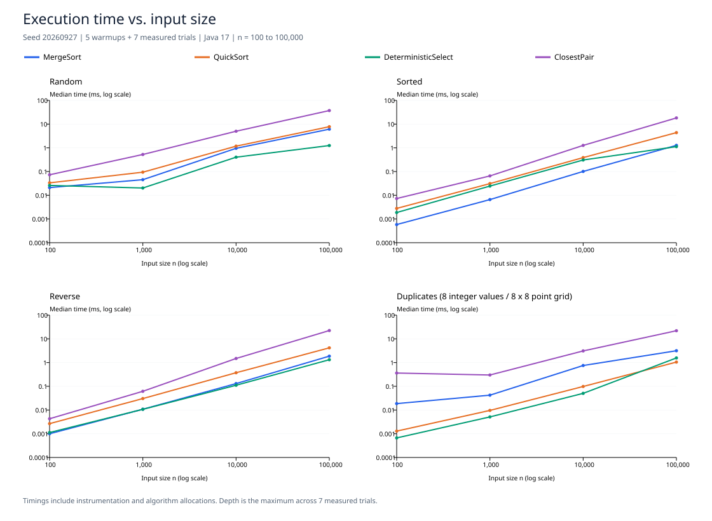
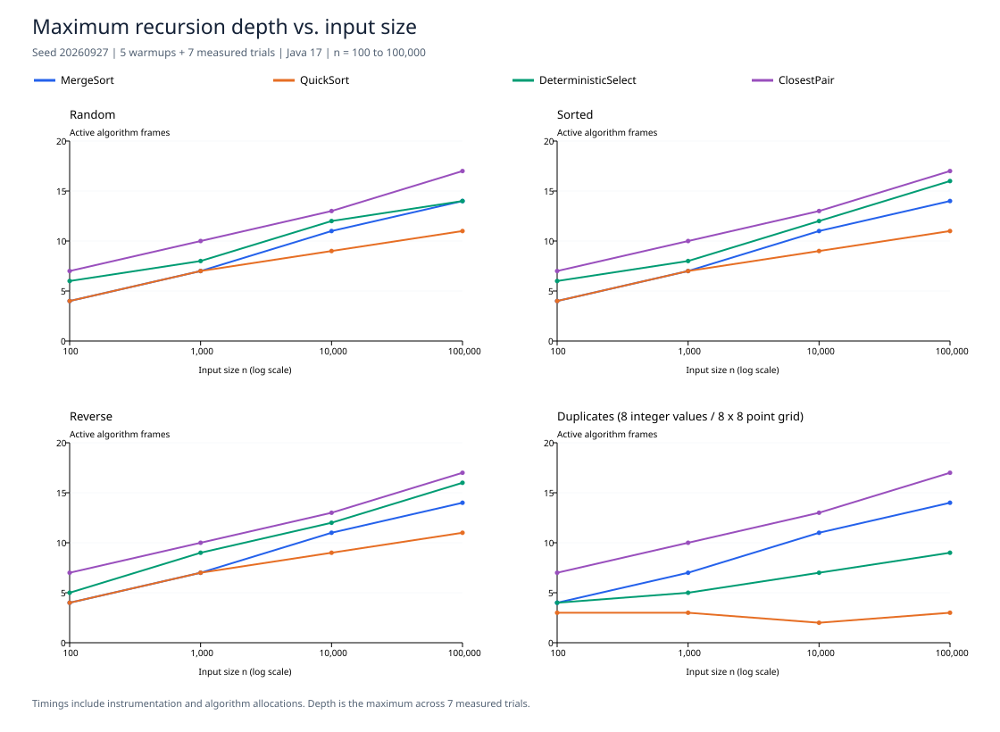

# Assignment 1: Divide-and-Conquer Algorithm Analysis

## A. Project overview

Java 17 implementations of MergeSort, randomized QuickSort, deterministic selection (Median-of-Medians), and closest pair of points. The project connects recurrence analysis with reproducible timing, stack-depth measurements, operation counts, and reference-based correctness tests.

### Run

A JDK 17 or later is sufficient; the shell runner requires no downloads:

```sh
sh run.sh demo
sh run.sh test
sh run.sh experiment
```

Alternatively, with Maven installed: `mvn test`. The Maven test phase invokes the same dependency-free `AlgorithmTests` harness through `exec-maven-plugin`; it is not a JUnit suite. The validated execution path for this report was the JDK shell runner; Maven was unavailable on the measurement machine. Maven may download its build plugins on first use.

Regenerate the plots with Python 3 and ReportLab:

```sh
python3 -m pip install reportlab
python3 scripts/plot_results.py
```

The committed README tables describe the saved CSV run. If you rerun experiments, regenerate plots and update the tables before comparing them. Test and demonstration transcripts are in `results/`; screenshots show those saved transcripts in a local HTML viewer.

### Structure

```text
src/          Seven requested classes plus Metrics.java
tests/       AlgorithmTests.java and test notes
docs/plots/  Time and recursion-depth SVG plots
docs/screenshots/  Browser captures of program output, tests and plots
docs/        Evidence HTML and Russian quick-start notes
results/     Summary CSV, raw CSV, environment and output transcripts
scripts/     Reproducible plot generator
pom.xml      Java 17 build and test configuration
run.sh       Dependency-free demo, test and experiment runner
```

### API conventions

- Sorting and selection mutate `int[]`. Selection ranks are zero-based and duplicate values occupy separate ranks.
- Sorting accepts empty arrays. Selection rejects an empty array or an invalid rank with `IllegalArgumentException`.
- Closest-pair returns the minimum Euclidean **distance** and preserves the caller's point array. Fewer than two points returns positive infinity; coincident points return zero.
- Null arrays/points are rejected. Coordinates must be finite and within +/-1e150, preventing distance overflow; distances use `Math.hypot`.
- Metrics reset on each valid call. Solver instances contain mutable metrics and are intended for sequential use.

## B. Algorithm analysis

| Algorithm | Time | Auxiliary space | Algorithm stack |
|---|---|---|---|
| MergeSort | Theta(n log n) | Theta(n) buffer | O(log n) |
| QuickSort | Expected Theta(n log n); worst Theta(n^2); all-equal Theta(n) | O(log n) stack, O(1) partition workspace | O(log n) worst case |
| DeterministicSelect | Theta(n) worst case | O(log n) stack; O(1) non-stack workspace | O(log n) |
| ClosestPair | Theta(n log n) | O(n) point references/buffer/sort workspace | O(log n) |

### MergeSort

Split a half-open interval in two, recursively sort both halves and linearly merge them. A single auxiliary array is allocated per public call and reused at every level. Intervals of at most 16 elements use insertion sort. Merging takes the left item on ties, making the algorithm stable.

For n > 16, `T(n) = 2T(n/2) + Theta(n)` (rounding omitted). Master Theorem case 2 gives Theta(n log n). The fixed insertion cutoff changes constants, not asymptotic growth. Even already sorted input is merged at every internal node in this implementation, so the asymptotic bound remains Theta(n log n). Live space is Theta(n) plus O(log n) frames.

### Randomized QuickSort

Choose a random pivot value and partition in place into less-than, equal-to, and greater-than regions. Equal keys are finished immediately. Recurse only into the smaller strict partition, then process the larger with a loop. No partition arrays are allocated.

For distinct keys, `T(n) = T(k) + T(n-k-1) + Theta(n)`. Balanced splits give `2T(n/2) + Theta(n)`, hence Theta(n log n) by Master Theorem. For randomized pivots the expected recurrence averages over k and yields Theta(n log n); the fixed-split Master Theorem alone does not prove this expectation. Repeated extreme pivots give `T(n) = T(n-1) + Theta(n) = Theta(n^2)`. All-equal input needs one Theta(n) partition.

Each nested call receives at most half the current elements. Therefore the **actual call stack is O(log n) even in the quadratic-time case**, stronger than just typical logarithmic depth. Tail iteration does not eliminate the work in bad partitions; it eliminates long chains of active frames.

### Deterministic Select (Median-of-Medians)

Insertion-sort groups of at most five, move their medians to an in-place prefix, and recursively select the median of that prefix. Three-way partition around this pivot and recurse only on the strict partition containing rank k, or return immediately if k is in the equal region. Pivot selection is a separate recursive subproblem; both data partitions are never explored.

Ignoring a constant number of exceptional groups, at least half of the group medians lie on each side of the pivot, and each full group contributes at least three qualifying elements. Thus each surviving strict side has at most `7n/10 + O(1)` elements. The worst-case bound is

`T(n) <= T(ceil(n/5)) + T(7n/10 + O(1)) + Theta(n)`.

The standard Master Theorem does not apply to unequal subproblem sizes. Akra-Bazzi intuition: solve `(1/5)^p + (7/10)^p = 1`. Since the sum at p=1 is 0.9, p<1. With linear work, `n^p * (1 + integral_1^n u^(-p) du) = Theta(n)`. Equivalently, recursive subproblem sizes total at most about 0.9n per level, so the linear work forms a convergent geometric sum. The top-level scan supplies Omega(n), yielding Theta(n) worst case. All arrays are reused in place; the shrinking recursive paths need O(log n) stack.

### Closest pair

Initially sort a cloned reference array by x. Split by index and save the split x-coordinate before descending. Base cases compare all pairs among at most three points. Each recursive call returns its slice in y-order; merge these slices in linear time with a reusable buffer. Build the strip whose x-distance from the split is below the current best distance. Inspect at most seven following points in y-order, stopping earlier when the y-gap is already too large. The planar packing argument bounds the number of possible improving neighbours. Tied x-coordinates are safe because the split uses indices; duplicate points yield distance zero.

After the initial O(n log n) sort, `T(n) = 2T(n/2) + Theta(n)`, so Master Theorem case 2 gives Theta(n log n). Re-sorting each strip by y would instead cause O(n log^2 n); maintaining y-order avoids that. The cloned array, shared buffer and initial object-sort workspace take O(n), with O(log n) recursive frames.

## C. Experiments

`System.nanoTime()` surrounds one complete algorithm call. Input generation, integer input cloning, solver construction and reference validation are excluded. Required internal allocations (the merge buffer, closest-pair clone/buffer and its initial x-sort) are included. Instrumentation is enabled, so these are timings of the instrumented algorithms.

- Sizes: 100 (small), 1,000 and 10,000 (medium), 100,000 (large).
- Types: random, sorted, reverse-sorted, duplicate-heavy.
- Integer duplicates: eight possible values. Point duplicates: an 8 x 8 integer grid. Other point coordinates are uniform in [0, 1,000,000).
- Sorted/reverse points refer to input order by x. Each configuration has a seeded dataset; different types use different datasets, so point-order effects are not isolated perfectly.
- Five unrecorded warmup calls followed by seven recorded trials for every configuration. Dataset seed: 20260927. QuickSort pivot seeds vary by trial.
- `results.csv`: 64 configuration summaries. `raw.csv`: all 448 measured trials. Median/min/max time is recorded; depth is the maximum over trials; operation and call counts are medians independently of the median-time trial.
- Integer operations count calls to `Integer.compare` (one three-way key comparison), not loop checks. Point operations count distance evaluations only, **not** x/y comparator calls or total work. These operation metrics cannot be compared directly across algorithm families.
- Depth counts simultaneously active recursive algorithm frames, root = 1; empty sort and fewer than two points = 0. QuickSort loop iterations are not recursive calls. Select depth includes median-prefix recursion. Closest-pair depth excludes Java's initial sorting internals.

Measurement environment:

```text
Java: 17.0.17+10
VM: OpenJDK 64-Bit Server VM
OS: Mac OS X 26.1
Architecture: aarch64
Available processors: 8
Max heap bytes: 2147483648
Seed: 20260927
Warmups per configuration: 5
Measured trials: 7
```

### Timing tables

Median execution time in milliseconds. Values below 0.001 ms and very small inputs are especially sensitive to measurement overhead and JVM state.

#### MergeSort

| Input | n=100 | n=1,000 | n=10,000 | n=100,000 |
|---|---:|---:|---:|---:|
| random | 0.021083 | 0.045417 | 0.952959 | 6.114416 |
| sorted | 0.000583 | 0.006583 | 0.101125 | 1.272209 |
| reverse | 0.001000 | 0.010791 | 0.130291 | 1.864916 |
| duplicates | 0.018666 | 0.042292 | 0.752708 | 3.158292 |

#### QuickSort

| Input | n=100 | n=1,000 | n=10,000 | n=100,000 |
|---|---:|---:|---:|---:|
| random | 0.033417 | 0.094084 | 1.176208 | 7.776542 |
| sorted | 0.002792 | 0.031083 | 0.387583 | 4.375208 |
| reverse | 0.002667 | 0.030417 | 0.373500 | 4.175833 |
| duplicates | 0.001292 | 0.009625 | 0.098250 | 1.050292 |

#### DeterministicSelect

| Input | n=100 | n=1,000 | n=10,000 | n=100,000 |
|---|---:|---:|---:|---:|
| random | 0.025958 | 0.020250 | 0.403417 | 1.248875 |
| sorted | 0.001875 | 0.024417 | 0.307042 | 1.123042 |
| reverse | 0.001125 | 0.010708 | 0.110583 | 1.321167 |
| duplicates | 0.000667 | 0.005125 | 0.050417 | 1.568167 |

#### ClosestPair

| Input | n=100 | n=1,000 | n=10,000 | n=100,000 |
|---|---:|---:|---:|---:|
| random | 0.073125 | 0.524208 | 5.007125 | 37.269250 |
| sorted | 0.007292 | 0.065417 | 1.266375 | 18.225459 |
| reverse | 0.004291 | 0.061583 | 1.489167 | 22.443292 |
| duplicates | 0.361958 | 0.299625 | 3.100042 | 22.039375 |

### Maximum recursion depth

| Algorithm | Input | n=100 | n=1,000 | n=10,000 | n=100,000 |
|---|---|---:|---:|---:|---:|
| MergeSort | random | 4 | 7 | 11 | 14 |
| MergeSort | sorted | 4 | 7 | 11 | 14 |
| MergeSort | reverse | 4 | 7 | 11 | 14 |
| MergeSort | duplicates | 4 | 7 | 11 | 14 |
| QuickSort | random | 4 | 7 | 9 | 11 |
| QuickSort | sorted | 4 | 7 | 9 | 11 |
| QuickSort | reverse | 4 | 7 | 9 | 11 |
| QuickSort | duplicates | 3 | 3 | 2 | 3 |
| DeterministicSelect | random | 6 | 8 | 12 | 14 |
| DeterministicSelect | sorted | 6 | 8 | 12 | 16 |
| DeterministicSelect | reverse | 5 | 9 | 12 | 16 |
| DeterministicSelect | duplicates | 4 | 5 | 7 | 9 |
| ClosestPair | random | 7 | 10 | 13 | 17 |
| ClosestPair | sorted | 7 | 10 | 13 | 17 |
| ClosestPair | reverse | 7 | 10 | 13 | 17 |
| ClosestPair | duplicates | 7 | 10 | 13 | 17 |

### Plots





## D. Discussion

**Do the results match theory?** For random data at n=100,000, MergeSort used 1,639,624 comparisons and QuickSort used 2,031,230. Dividing by n log2(n) gives approximately 0.99 and 1.22 respectively. Median-of-Medians used 418,821 comparisons, about 4.19n. Its random-input comparison counts at successive sizes were 625, 4,029, 81,075 and 418,821: the constant varies with when the requested rank is found, so exact scaling need not be smooth. These observations are consistent with, but do not prove, the theoretical bounds.

Closest-pair random-data distance counts were 136, 1,149, 13,012 and 142,600. The roughly linear number of distance calculations does not imply a linear total algorithm: sorting, merging and strip construction still contribute O(n log n). At 100,000 points a full pair enumeration would require 4,999,950,000 distance calculations, compared with 142,600 observed in the fast solver. We did not run that large brute-force benchmark, so this is an operation-count comparison, not a measured speedup.

**How does input structure affect performance?** At n=100,000, MergeSort took 6.114 ms for random data versus 1.272 ms for sorted data; fewer insertion-sort shifts and predictable merge decisions reduce constants. Randomized QuickSort avoids the systematic sorted-input worst case of a fixed end pivot. Its duplicate-heavy median was 1.050 ms, versus 7.777 ms for random values: three-way partitioning removes all copies of the pivot at once. Duplicate-heavy selection is not invariably faster (1.568 ms vs 1.249 ms here), because pivot/rank placement and runtime noise matter. Closest-pair sorted input took 18.225 ms versus 37.269 ms random; Java's adaptive object sort can exploit order, but dataset differences and execution order also affect the comparison.

**Why does smaller-first recursion help QuickSort?** It bounds nested frames by a halving chain. Measured random-input depths were 4, 7, 9 and 11; duplicate-heavy depths never exceeded 3. It protects stack usage even if the total partition work becomes quadratic.

**Why does Median-of-Medians guarantee linear worst-case time?** Its pivot always discards a constant fraction of candidates outside a small rounding allowance, while the median-prefix problem has only about n/5 elements. The combined recursive size is below n and each level adds linear work. Three-way partitioning preserves progress when many elements equal the pivot.

**Why is closest-pair faster than quadratic search at scale?** Each divide-and-conquer level does linear merge/strip work and only bounded neighbour checks per strip point; there are O(log n) levels. Brute force checks every possible pair, Theta(n^2).

**Practical limitations.** JVM JIT compilation, branch prediction, caches, timer granularity, object references, allocations, garbage collection, system load and power state affect elapsed time. Five warmups do not fully isolate the JIT: for example, random selection at n=100 was slower than at n=1,000, and duplicate-heavy closest-pair at n=100 was slower than at n=1,000. Configurations run in a fixed order in one JVM; later cases may benefit from earlier compilation. These are educational measurements, not a controlled JMH benchmark or statistical proof. The raw trials and min/max columns preserve variability. Timings compare different tasks (sorting, selection, geometric distance) and should not be read as interchangeable solutions to one problem.

## E. Reflection

This implementation illustrates how asymptotic complexity and practical performance answer different questions. The recurrence describes growth, while comparison counts and repeated timings reveal constants, duplicate handling and runtime effects. Measuring active recursion frames also makes the difference between QuickSort's conceptual partition tree and its real stack usage explicit.

The main implementation challenges are preserving the y-order invariant in closest-pair while reusing one buffer, maintaining correct global rank indices after in-place median extraction, and keeping repeated equal keys from causing unnecessary work. Reference comparisons against sorted arrays and brute-force distances provide evidence that these details are correct. This technical reflection describes the project; the submitting student should adapt it to their own learning experience.

## F. Tests and screenshots

`sh run.sh test` passed **6,176 explicit checks**:

- MergeSort/QuickSort vs `Arrays.sort`: empty, singleton, integer extremes, random, sorted, reversed, duplicate-heavy and all-equal arrays, plus 200 randomized cases; QuickSort depth bounds checked.
- Selection: 500 random datasets with random/minimum/maximum ranks; every rank at sizes 1..80; sorted/reverse/all-equal cases and integer extremes.
- Closest-pair vs independent O(n^2) brute force up to n=2,000: random, vertical/horizontal lines, duplicates, tiny sets, large coordinate magnitudes and 200 randomized cases. A known-answer collinear n=100,000 dataset exercises the large fast path. Caller input preservation checked.
- Invalid inputs and metric reset checked. During experiments, all integer outputs are validated; closest-pair configurations with n <= 2,000 are brute-force validated outside the timer.

Screenshots below capture a local browser viewer of the actual saved output logs and generated plots; they are not simulated terminal sessions.


## G. Git history and submission

The repository contains incremental commits made during implementation, test execution and report preparation, followed by tag `v1.0`. The source was not committed as an invented backdated history. Use `git log --oneline --reverse` to inspect it.

Repository: [whoisaii/daa-a1](https://github.com/whoisaii/daa-a1).

The original GitHub initialization commit is preserved alongside the incremental implementation history. Tag `v1.0` identifies the completed assignment. Submit the repository URL above.

The delivered ZIP includes `.git` so that history survives extraction. To obtain a fresh working copy:

```sh
git clone https://github.com/whoisaii/daa-a1.git
cd daa-a1
sh run.sh test
```

Do not upload only the source files through the web uploader if you need to preserve the existing Git history.
