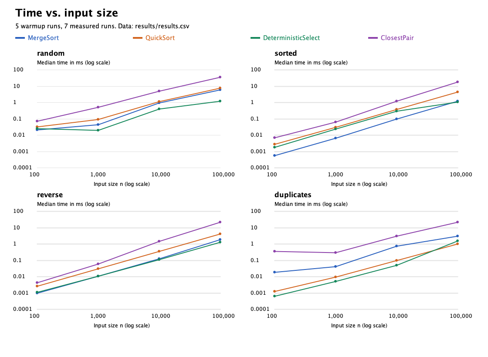
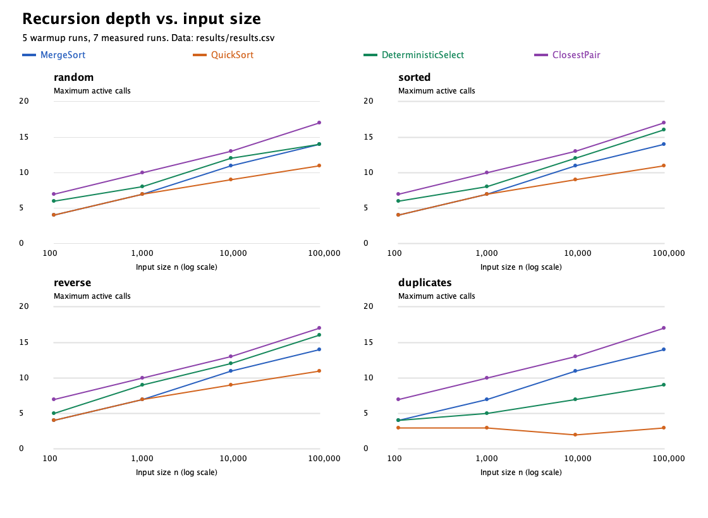
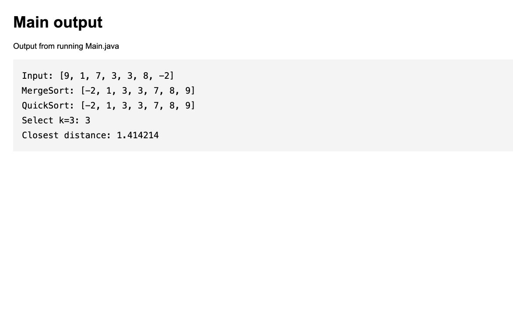
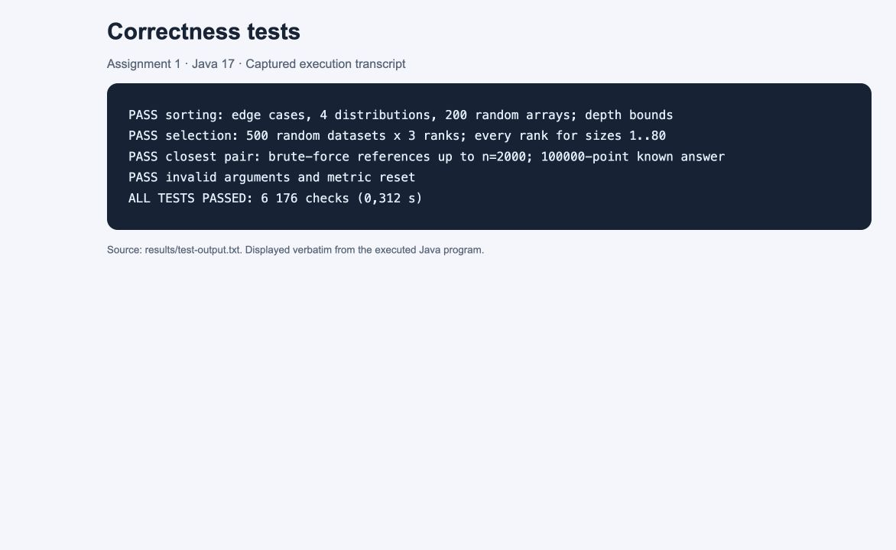
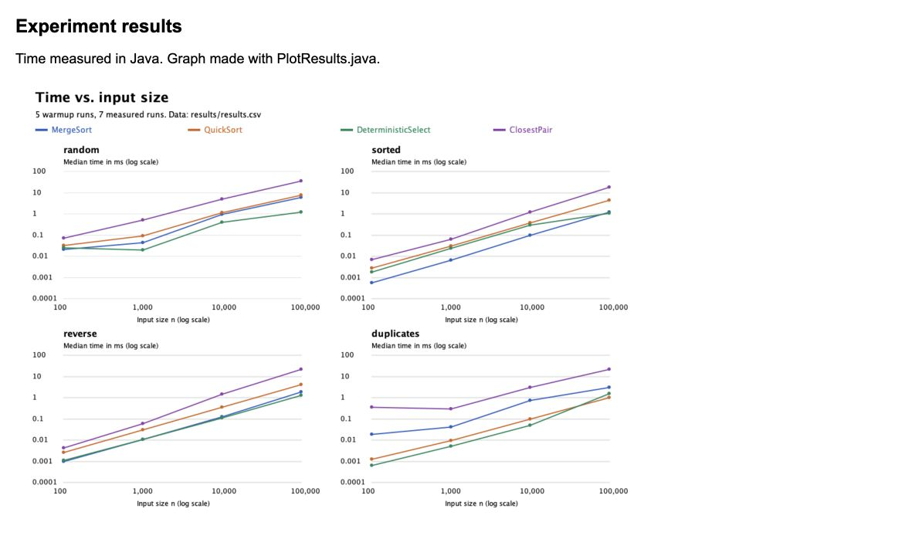

# Assignment 1: Divide and Conquer

This project has four Java algorithms. It compares their speed and recursion depth on different inputs.

## Code

| File | What it does |
|---|---|
| [MergeSorter.java](src/MergeSorter.java) | Sorts numbers with MergeSort |
| [QuickSorter.java](src/QuickSorter.java) | Sorts numbers with QuickSort |
| [DeterministicSelector.java](src/DeterministicSelector.java) | Finds the k-th smallest number |
| [ClosestPairSolver.java](src/ClosestPairSolver.java) | Finds the shortest distance between two points |
| [Main.java](src/Main.java) | Runs a small example of all four algorithms |
| [Experiment.java](src/Experiment.java) | Measures time, depth and operations; saves CSV |
| [Point.java](src/Point.java) | Stores x and y coordinates |
| [Metrics.java](src/Metrics.java) | Counts operations and recursion depth |
| [PlotResults.java](src/PlotResults.java) | Makes the two graphs from CSV using Java |
| [AlgorithmTests.java](tests/AlgorithmTests.java) | Checks the answers |

## Run

Use Java 17. In IntelliJ IDEA, open this folder as a Maven project (`pom.xml`). Set the working directory to the project folder.

- Run **Main.main()** for a small example. Change `input` in Main to try other numbers.
- Run **AlgorithmTests.main()** to run the tests.
- Run **Experiment.main()** to make new CSV results.
- Run **PlotResults.main()** to update the graphs after an experiment.

Maven can also run the tests with `mvn test`. The saved results were tested with Java directly.

## How the algorithms work

**MergeSort:** Split the array into two parts. Sort each part and merge them. One extra array is reused. For 16 or fewer values, use insertion sort.

**QuickSort:** Pick a random pivot. Put smaller, equal and larger values into three groups in the same array. Call the method again for the smaller side. Use a loop for the larger side.

**Median-of-Medians:** Make groups of five. Find each group's median, then find the median of these medians. Use it as the pivot. Continue only on the side that contains k. Here, k starts at 0.

**Closest Pair:** Sort points by x. Split them into two parts. Find the best distance in each part. Merge the points in y order and check a narrow strip near the middle. Each strip point needs at most seven next neighbours. With fewer than two points, the result is infinity.

## Complexity

| Algorithm | Time | Extra space |
|---|---|---|
| MergeSort | Theta(n log n) | O(n) |
| QuickSort | Expected Theta(n log n), worst O(n²) | O(log n) stack |
| Median-of-Medians | Worst-case Theta(n) | O(log n) stack |
| Closest Pair | Theta(n log n) | O(n) |

- **MergeSort:** `T(n) = 2T(n/2) + O(n)`. Master Theorem, case 2: Theta(n log n).
- **QuickSort:** `T(n) = T(k) + T(n-k-1) + O(n)`. Balanced splits give Theta(n log n) by Master Theorem. Random pivots give this time on average. Always picking an end value can give `T(n) = T(n-1) + O(n)`, or O(n²).
- **Median-of-Medians:** `T(n) <= T(n/5) + T(7n/10 + O(1)) + O(n)`, with rounding. The two parts total about 0.9n. Akra-Bazzi intuition: the work gets smaller by a fixed factor at each level. The total is O(n), and the first scan needs Omega(n), so the bound is Theta(n).
- **Closest Pair:** `T(n) = 2T(n/2) + O(n)`. Master Theorem, case 2: Theta(n log n). Sorting by x also takes O(n log n). Merging by y avoids sorting again at each level.

## Results

Inputs: random, sorted, reverse-sorted and many duplicates. Sizes: 100, 1,000, 10,000 and 100,000. Duplicate arrays have eight possible values; duplicate points use an 8 x 8 grid.

Each case has 5 warmup runs and 7 measured runs. Time uses `System.nanoTime()`. The table shows the median in milliseconds. Input setup is outside the timer. Algorithm memory allocation and counters are inside it. Environment: Java 17, macOS, ARM64. Seed: 20260927.

| Algorithm / input | 100 | 1,000 | 10,000 | 100,000 |
|---|---:|---:|---:|---:|
| MergeSort / random | 0.0211 | 0.0454 | 0.9530 | 6.1144 |
| MergeSort / sorted | 0.0006 | 0.0066 | 0.1011 | 1.2722 |
| MergeSort / reverse | 0.0010 | 0.0108 | 0.1303 | 1.8649 |
| MergeSort / duplicates | 0.0187 | 0.0423 | 0.7527 | 3.1583 |
| QuickSort / random | 0.0334 | 0.0941 | 1.1762 | 7.7765 |
| QuickSort / sorted | 0.0028 | 0.0311 | 0.3876 | 4.3752 |
| QuickSort / reverse | 0.0027 | 0.0304 | 0.3735 | 4.1758 |
| QuickSort / duplicates | 0.0013 | 0.0096 | 0.0983 | 1.0503 |
| DeterministicSelect / random | 0.0260 | 0.0203 | 0.4034 | 1.2489 |
| DeterministicSelect / sorted | 0.0019 | 0.0244 | 0.3070 | 1.1230 |
| DeterministicSelect / reverse | 0.0011 | 0.0107 | 0.1106 | 1.3212 |
| DeterministicSelect / duplicates | 0.0007 | 0.0051 | 0.0504 | 1.5682 |
| ClosestPair / random | 0.0731 | 0.5242 | 5.0071 | 37.2692 |
| ClosestPair / sorted | 0.0073 | 0.0654 | 1.2664 | 18.2255 |
| ClosestPair / reverse | 0.0043 | 0.0616 | 1.4892 | 22.4433 |
| ClosestPair / duplicates | 0.3620 | 0.2996 | 3.1000 | 22.0394 |

Maximum recursion depth for random input (root = 1):

| Algorithm | 100 | 1,000 | 10,000 | 100,000 |
|---|---:|---:|---:|---:|
| MergeSort | 4 | 7 | 11 | 14 |
| QuickSort | 4 | 7 | 9 | 11 |
| DeterministicSelect | 6 | 8 | 12 | 14 |
| ClosestPair | 7 | 10 | 13 | 17 |

[Full results](results/results.csv) include depth for every input type, comparison counts, distance checks and recursive calls. [Raw results](results/raw.csv) contain all 448 measured runs. Depth is the maximum over seven runs; other counts are medians. Closest Pair counts distance checks, not all its work. QuickSort loop steps do not add stack depth.

### How to read the graphs

`Experiment.java` measures the runs and writes `results.csv`. `PlotResults.java` reads that file and draws the lines. The pictures show measured values, not values guessed from a formula.

- **X axis:** input size n. Moving one step right means 10 times more items.
- **Time graph:** Y is milliseconds. Each colour is one algorithm. Lower means less time. The Y scale also uses steps of 10.
- **Depth graph:** Y is the most algorithm calls open at once. Lower means less stack depth. This Y scale is normal, not logarithmic.
- The four small panels show random, sorted, reverse and duplicate inputs. Lines connect the four measured sizes; sizes between them were not tested.

For example, random MergeSort at n=100,000 has a median of 6,114,416 ns. Dividing by 1,000,000 gives **6.114416 ms**, the point on the time graph. Its depth is **14**, the point on the depth graph. The median is the fourth value after sorting seven measured times.

## Discussion

**Does the result fit the theory?** More data usually takes more time. The depth grows slowly. This fits the expected complexity, but four sizes cannot prove a time bound.

**Does input order matter?** Yes. MergeSort was faster on sorted data. QuickSort was faster with repeated values because it skips the whole equal group. Selection only finds one number, so its time is not a fair comparison with sorting the full array.

**Why does QuickSort use the smaller side first?** Each new call gets at most half the current data. Fewer calls stay open at once, so the stack stays small. Bad pivots can still make the total work slow.

**Why is Median-of-Medians O(n)?** The pivot removes a fixed part of the data each time. The next two problems together have about 90% of the old size. Adding the work gives a linear total.

**Why is Closest Pair faster than checking every pair?** It splits the points and only checks a few nearby points across the middle. Full search checks n(n-1)/2 pairs. This becomes very large when n grows.

**Why are some times uneven?** Java gets faster after warmup. Cache, memory cleanup and other programs also affect time. Small runs are especially hard to measure. That is why each case runs seven times and uses the middle time.

## Tests

**6,176 checks passed.** Sorting is compared with `Arrays.sort()` on empty, single, random, sorted, reverse and duplicate arrays. Selection uses 500 random datasets and checks answers against sorted arrays. Closest Pair is compared with full search up to 2,000 points. A 100,000-point line has a known answer and tests a large input.

## Reflection

The main lesson is that a faster algorithm does not always have a shorter running time for small inputs. Input order and repeated values also matter. Checking answers with a simple reference method helps find mistakes.

The hardest parts of this solution are keeping points in y order and keeping the correct k index during selection. QuickSort also shows why the number of steps and the number of active calls are different.

## Screenshots

These screenshots show the saved Java output, test results and a graph made from the CSV data.

Show program output, tests and graph

**Example output from Main:**

**Test results:**

**Graph of measured results:**

